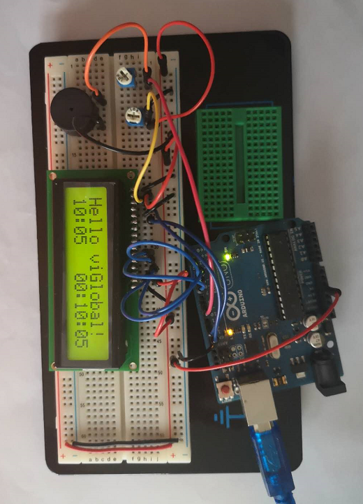

# RaspberryPi
<pre>
Congratulations!
You've successfully installed OpenCV 4.5.5 on your Raspberry Pi 32-bit OS
pi@raspberrypi:~ $ python
Python 3.9.2 (default, Mar 12 2021, 04:06:34) 
[GCC 10.2.1 20210110] on linux
Type "help", "copyright", "credits" or "license" for more information.
>>> import cv2
>>> cv2.__version__
'4.5.5'
>>> 
</pre>
* upgrade Pi2 to May 2020 version, installed virtual keyboard
* PI4 update and installed virtual keyboard, switch fan from Push to Pull direction
* Pi2 & Pi4 use VNC to release the HDMI, mouse, keyboard wires.
* Pi2 add 2FA to [SSH](https://www.raspberrypi.org/blog/setting-up-two-factor-authentication-on-your-raspberry-pi/) & [VNC](https://www.raspberrypi.org/forums/viewtopic.php?t=226283)
* [The Crackerjoke-a-tron](https://www.raspberrypi.org/blog/the-crackerjoke-a-tron/)
* [How to Connect a Liquid Crystal Display up to the Arduino](https://www.youtube.com/watch?v=z-j1j6XIUFI&t=128s)
* [Build Seven Segment LED clock with Arduino and DS3231](https://www.youtube.com/watch?v=qB0drI56zGE)
* [lcd reference](https://forum.arduino.cc/index.php?topic=185613.0)
* [oop](https://roboticsbackend.com/arduino-object-oriented-programming-oop/)
* [10 points](https://roboticsbackend.com/the-arduino-language-in-10-points/)
* [callback](https://www.onetransistor.eu/2019/05/arduino-class-interrupts-and-callbacks.html)
* [Interrupt Tutorial](http://www.gammon.com.au/forum/?id=11488)

